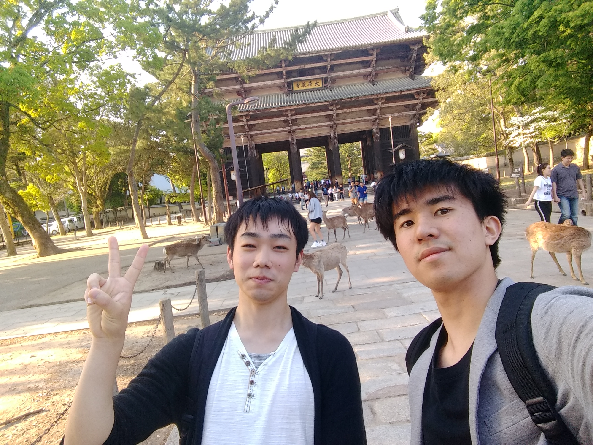

<!-- textlint-disable -->

「先輩、日曜日暇ですか？」 
「ひま」
「デート行きましょう」
「自分は大丈夫だけど」

はじめてのデートである。私達は計画を練った。夕食にラーメンを食べる事を始めに決定した。あとはその場で考えることにした。

床に着いてから目を閉じると、明日への期待に胸がふくらんだ。頭元の時計に目をやると六時を指し示していた、ブラインドから朝の光が差し込む。私は腕で目を覆い、眠りに落ちた。眠りづらい朝であった。そろそろ布団の綿を抜いたほうが良いかもしれない。

うなされながら目が覚めると11時であった、集合は16時であるからまだまだ余裕がある。汗でびっしょりであったので、シャワーを浴びた。今日来ていく服装には悩んだ、果たしてデートにふさわしい服装とは如何なるものであろうか。いくら考えても埒が明かないので、とりあえず最近買ったジーパンとカーディガンだけ決めて、それに合うものを探した。紺のジーパン、ライトグレーのカーディガン、黒のTシャツ、自信は無いが恐らくそう不味くはないだろう。髪をセットするとそれなりにまともな人間に見えた。 

私は15分早く現地に着く電車を選んだ。相手を待たせるのはマズいが、あまり早くついても嫌味に感じられてしまうかもしれない。15分はちょうどよい時刻に思えた。駅に着くと既に電車が来ていた、予定より早いではないか、私は息を切らして電車に飛び乗った。逆向きの電車であることに気付いたのは駅を出てからの事である。 

「すみません、電車を逃してしまったので5分遅れます」 
「おっけー」

電車の乗り換えは難しい、人類にはまだ早いのではないか。仕方ないので新しい乗り換え経路を確認した後、顔を上げると、斜向かいの席に座っていた日焼けした少女が目に付いた、傍らには祖母らしき人物が座っている。少女はスマホを片手で弄りながら両足を所在なさげにしている。ホットパンツを履いているので筋肉質な細い足がまぶしかった。角には全身を黒い服で包んだ女が立っていた。葬式帰りかと思ったが、その割にはカジュアルであるし、後ろ手に緑色の風船を持っていた。今日は暑い、あんな格好をしていたら死んでしまうのではないか、私はデートだというのに汗びっしょりであった。冬から突然夏がやって来たようにさえ感じる。こんなことならアウターは必要なかったかもしれない。

私はイヤフォンをスマホに挿してプレイリストをランダム再生した。いつもはワイヤレスのヘッドフォンを使っていたが、髪型が崩れるのを嫌った私はイヤフォンを久しぶりに家から持ち出した。『Autumn Leaves』が流れ始めた、日本では『枯葉』として知られている曲だ、失恋ソングである。 

奈良駅についた頃には予定通り約束の時刻を過ぎており、ロビーを見渡しても先輩の姿は見当たらない。

「どこに居ますか？」

連絡を送った途端、先輩はどこからともなく姿を表した。

「あ、いたいた」
「先輩どこに居たんですか？」

聞けば本屋にいたという。待たせてしまっただろうか、それとも早めに来ていたのだろうか。先輩は常に笑顔で何を考えているか分かり辛い。

「本日はデートですが」
「プラン考えてないよ」
「私もあんまり考えていません」
「OK google, 最寄りの観光地」

話し合いの結果、東大寺に向かうことになった。東大寺ならよく知っている、適当に歩き回っても楽しい。しかし駅からは少し離れている。

「どうやって移動しますか？」
「う〜ん、歩こっか」

私達は東大寺に向かって歩きだした。

「先輩って高校生のときは部活は何やってたんですか？」
「卓球やで」
「あれ、私と一緒ですね」
「君は吹奏楽部じゃなかったっけ？」
「中学時代です」

奇遇なことに、先輩は私のことを覚えていた。私達は昔話に花を咲かせた。たいていこういう時私は苦痛を感じるが、その日は楽しかった。

「デートでの悪手って知ってますか？」
「知らんなあ」
「いくつか調べたんですが……デートにラーメンは最悪らしいですよ」

先輩が笑うと、私も釣られて笑ってしまった。数キロあったはずだが、意外とすぐに目的地に着いた。特に目的もなかった私達は東大寺を一周することにした。金の持ち合わせがなかった上にあまり興味もなかったので、大仏殿には立ち入らなかった。

「そろそろ腹が減ってきたな」
「そうですね」

最後に二月堂に登って奈良市を上から見下ろした。深い緑色の紅葉が美しかった。紅葉シーズン以外に紅葉に注意を向けたのは初めてかもしれない。

「お兄さん達人力車に乗らんか？男二人でも楽しめると思うで」

私は黙って首を降った。

「煽られた……」

先輩が小声で呟くと、人力車引きのお兄さん達は豪快に笑った。私もあまり嫌な気はしなかった。私達はバスに乗って奈良駅に向かった。

「でも人力車に乗っても楽しかったかもしれませんね」
「せやなぁ、でも高いらしいで」
「学生には厳しいでしょうか……」

奈良駅に着いてから先輩がお手洗いに行きたいと言ったので、駅に併設されたショッピングモールに入った。私は待ち時間を本屋で潰す事にした。先日読んだ本が面白かったので、同じ著者で一番有名なものを購入した。その後合流した先輩と漫画の置いてある棚に向かった。私は何冊か気になる本を見つけたが、価格を見るとどうしても買う気が起きなかった。バイトもそろそろ初めいないといけないだろうか。そういえば先輩もしたことがないと言っていた。

「先輩、そろそろバスが来ますよ」
「じゃあそろそろ行こっか」

バスターミナルで私達は自撮りをした。慣れなかったがなかなかいい出来栄えであった。バスに乗ると、少し手持ち無沙汰になったのでサッと要点のみのメモを書き起こした。これが有ると無いとでは、今日一日何をしていたかを思い出すのにかかる苦労が段違いである。しばらくすると、目当てのラーメン屋に一番近いバス停に到着した。

凄い臭気だ、店から10mは離れているのに匂いが伝わってくる。店の前には行列ができている。私達は『上村』と記名して、店の前で時間がすぎるのを待つことにした。 しばらくすると、私達は店の中に通された。

向かい合って座る席であった。ここにコーヒーが出てくれば完璧で会っただろう。

「この席はデートっぽいですけど、それ以外はアウトですね」

服に匂いが染み付くので大半の女性は嫌な顔をするだろう。鼻の悪い私でさえここまで匂いを感じるのだから相当酷いはずだ。それに、会話を楽しむには店内は煩すぎる。

先輩は歩いている店員に声を掛ける。

「すいません、霧島二つ」

しばらくして運ばれてきたラーメンに私は息を飲んだ。そのラーメン(?)の液面には油が膜を貼り、液面は鈍く光を反射させている。膜の下では液が未だ流動し続けているらしく、ごぼりごぼりと湧く液で膜がたゆたっていた。赤みの残るチャーシューはローストビーフに見える。麺は透明感があり、角が立っていた。

「なんですかこれ」

先輩いわく美味しく食べられる限界の濃さのラーメンだそうだ。過去にはテレビ番組で日本一濃いラーメンとして報道されたことがあるらしい。どのように調理すればこれほど濃いスープが出来るのか。スープが真っ黒になるまで煮込んだ和歌山ラーメンですらまだ液状を保っている。一方、これはラードに近い。恐る恐る麺をすすると、スープが麺にまとわりついてくる。絡むどころの騒ぎではない。試しにレンゲでスープを飲むと喉に油がへばりついて酷い目にあった。濃すぎて味がよくわからない、以前油を飲んだ時と同じような味がする。トッピングがどれもこれも美味しいだけに少しもったいないと感じた。とにかくメチャメチャなラーメンである。

水が無ければ完食も危うかっただろう。汁を飲むと体調を崩すと判断した私は箸を置いた。

「美味しいやろ？」
「これは飲むラードですね」

ラーメンを食べ終えても食べ足りない私はミニ軟骨丼を注文した。ミニと言う割にはかなりのサイズの丼が出てきた。一口食べる。

「あ、」
「どうしたん？」
「これラーメンと同じ味がします」

そのまま二口、三口と食べ進める。途端、箸が止まる。体が限界を訴えている。もう食べるべきではない。突然であった。しかし、私は幼い頃から食事は食べ残さないように躾けられて育った。この一口で救われる命もあるのだ。

「もう結構ですね」
「え〜」

私達はラーメンニ杯と丼一杯にしては法外な値段を払い、店を出た。当然である、あのラーメン一杯で五杯は普通のラーメンが出来る。私達がバス停に立つと、バスはすぐに着た。

「良かったですね先輩、こんなに慕ってくれる可愛い後輩がいて」
「それはそうかもしれん」

その後は私が先輩にジュースを奢ってもらい、電車の出発もすぐだったのでアッサリと分かれて帰路についた。

ああ、せめて手を握るぐらいしても良かったかもしれない。

